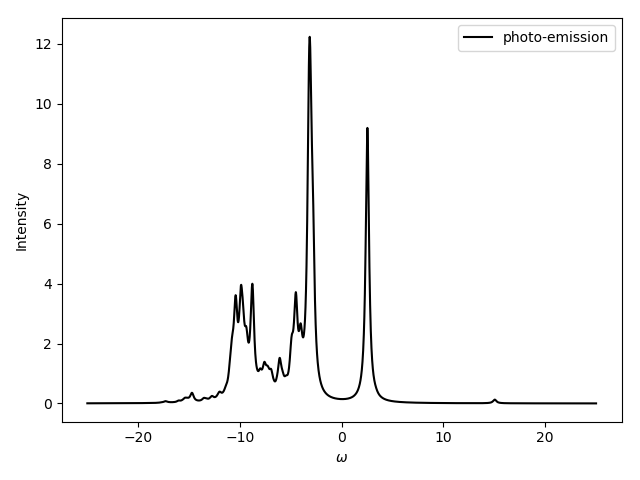
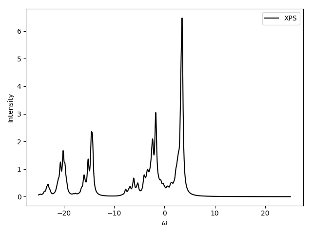
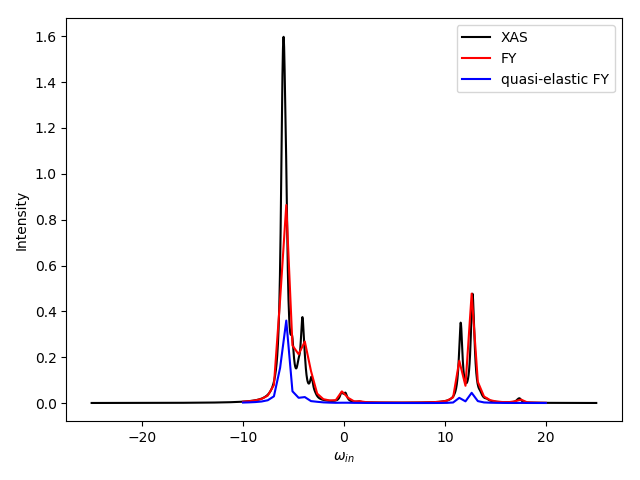
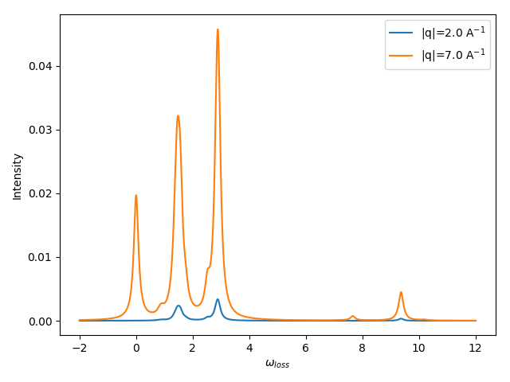
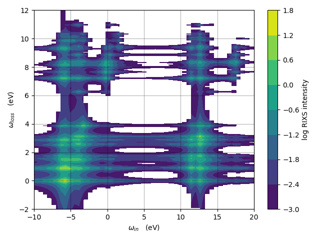

# Impurity model

### Introduction 

Calculate many-body states of an impurity Anderson model and a few spectra, e.g. photoemission spectroscopy (PS), x-ray photoemission spectroscopy (XPS), x-ray absorption spectroscopy (XAS), non-resonant inelastic x-ray scattering (NIXS), and resonant inelastic x-ray scattering (RIXS).

Credits to Petter Saterskog for inspiration and for some of the key functionality.

Credits to Patrik Thunstrom for discussions about computational algorithms.

<figure>
<div class="row"> 
  <div class="column">
  
  
  
  
    </div>
</div>
<figcaption>Spectra of NiO using one bath orbital per 3d orbital.</figcaption>
</figure>

### Get started
- Python 3.x is needed with libraries `mpi4py`, `bitarray`, `numpy`, `sympy`, and `scipy`. 
The Python library `h5py` is recommended but not necessary. 
For help in installing Python 3.x and/or Python libraries, please see e.g. 
[https://github.com/JohanSchott/impurityModelTutorial](https://github.com/JohanSchott/impurityModelTutorial)

- Add the absolute parent path of the directory (`impurityModel`) to the `PYTHONPATH` environment variable, such that the Python module in this directory can be found. For example, if the path to the `impurityModel` folder is `path/to/folder/impurityModel`, put the following command in the `~/.bashrc` file:
```bash
export PYTHONPATH=$PYTHONPATH:path/to/folder
```

- Optionally, for convienience add the absolute path of the sub directories `impurityModel/scripts` and `impurityModel/plotScripts` to the `PATH` environment variable. This enables the Python scripts to be found, without having to specify the absolute path to the scripts. If this is desired, add the following to the `~/.bashrc`:
```bash
export PATH=$PATH:path/to/folder/impurityModel/scripts
export PATH=$PATH:path/to/folder/impurityModel/plotScripts
```

- Create a directory somewhere and execute one of the example scripts in the `impurityModel/scripts` folder. E.g. type:
```bash
Ni_NiO_1bath.py 
```
or for usage of more than one MPI process, type e.g.:
```bash
mpirun -n 3 Ni_NiO_1bath.py 
```

#### Output files
Input parameters used are saved and stored in `.npz` format.
Spectra are stored in either one `.h5` file or in many `.npz` files.
Some small size spectra are also stored in `.dat` and `.bin` format, for easy and fast plotting with e.g. gnuplot.
For plotting all generated spectra (using matplotlib), type:
```
plotSpectra.py
```
For only plotting the RIXS map, type:
```
plotRIXS.py
```
or plot using gnuplot: 
```
plotRIXS.plt
```

### Optimization notes

#### Computational speed
MPI is used. 
For finding the ground states and calculating the spectra (except for RIXS), parallelization is done over the product states in the many-body basis.
For the RIXS simulations, parallelization is by default first done over product states of the core-hole excited system and then over the in-coming photon energies.

#### RAM memory usage
The memory goes primarly to storing the Hamiltonian in a basis of product states.
This Hamiltonian is stored as a dictionary, with product states, |ps>, as dictionary-keys 
and the Hamiltonian acting of each product state, H|ps>, as dictionary-values. 
When several ranks are used, the information is distributed over the MPI ranks, such that one rank only stores
some of all the product-state keys. This reduces memory usage for each MPI rank. 

A sparse matrix format of the Hamiltonian is used when generating a spectrum. 
This sparse matrix variable is also distributed in memory over the MPI ranks. 
This is done to reduce memory usage per MPI rank.

A product state with electrons in spin-orbitals with indices e.g. 2 and 5 can be described by the tuple: (2,5). 
If the system has 7 spin-orbitals in total, the product state can also be described by the binary-string "0010010".
The product state can also be translated into the base-2 integer 2^(7-1-2) + 2^(7-1-5) = 2^4 + 2^1 = 16+2 = 18.
With many electrons the integer representation is a more memory efficient format.
Bitarray is a class which also can be used to represent a product state. 
It is mutable which enables fast modifications (adding and removing electrons), and is used in the current version.
To keep the memory usage down, an imutable bytes class is also used in the current version.

### Documentation
The documentation of this package is found in the directory `docs`.

To update the manual, go to directory `docs` and simply type:

```
make html
```
to generate a html-page.
To instead generate a pdf-file, type:
```
make latex
```
and follow the instructions.

Note:
- package `numpydoc` is required. If missing, e.g. type `conda install numpydoc` 
- If a new module or subpackage is created, this information needs to be added to `docs/index.rst`. 


