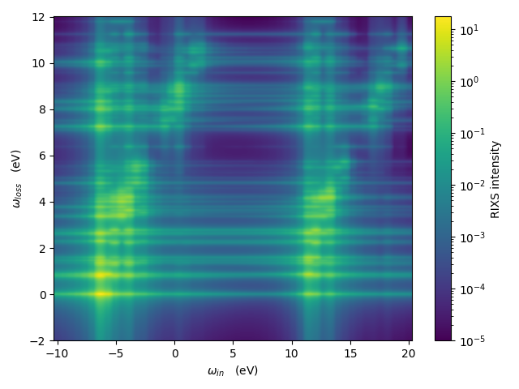

# Impurity model

### Introduction

Calculate many-body states of an impurity Anderson model and a few spectra, e.g. photoemission spectroscopy (PS), x-ray photoemission spectroscopy (XPS), x-ray absorption spectroscopy (XAS), non-resonant inelastic x-ray scattering (NIXS), and resonant inelastic x-ray scattering (RIXS).

Credits to Petter Saterskog for inspiration and for some of the key functionality.

Credits to Patrik Thunstrom for discussions about computational algorithms.

<figure>
<div class="row">
  <div class="column">
  
  
  
  
    </div>
</div>
<figcaption>Spectra of NiO. Simulated using 50 bath orbitals coupled to the Ni 3d orbitals.</figcaption>
</figure>

### Get started
- Run the bash-script `setup.sh`:
```bash
source setup.sh
```
This will create a Python virtual environment, install the required Python packages, and run the unit-tests.

- Activate the virtual environment and set the PYTHONPATH:
```bash
source env.sh
```

- To perform a simulation, first create a directory somewhere on your computer.
Then execute one of the example scripts in the `scripts` folder. E.g. type:
```bash
path/to/folder/impurityModel/scripts/run_Ni_NiO_Xbath.sh
```
This will create start a simulation with 10 bath states and one MPI rank.
To have e.g. 20 bath states instead of 10, instead type:
```bash
path/to/folder/impurityModel/scripts/run_Ni_NiO_Xbath.sh 20
```
To have e.g. 20 bath states and 3 MPI ranks, instead type:
```bash
path/to/folder/impurityModel/scripts/run_Ni_NiO_Xbath.sh 20 3
```
These examples will read an non-interacting Hamiltonian from file.

A simpler non-interacting Hamiltonian can instead be constructed by crystal-field parameters.
This is done for NiO by typing:
```bash
path/to/folder/impurityModel/scripts/run_Ni_NiO_CFparam.sh
```
Although using a crystal-field approach is a bigger approximation, it is convinient when doing fitting to experimental spectra.
But for more accurate simulations it is better to read in a non-interacting Hamiltonian from file, that has been constructed from e.g. DFT or DFT+DMFT simulations.
The non-interacting Hamiltonians read from file by the scripts `run_Ni_NiO_Xbath.sh` and `run_Ni_NiO_Xbath.sh` have been constructed using non-spin polarized DFT calculations.

- The bash-scripts in the `scripts`-folder act as templates and can easily be modified. For example, to set the temperature to 10 Kelvin in `get_spectra.py`, add `--T 10` as input when calling the python-script.

- For practical advise for usage on two computer clusters in Sweden, or help in installing Open-MPI, Python 3.x, or Python libraries, please see e.g.
[https://github.com/JohanSchott/impurityModelTutorial](https://github.com/JohanSchott/impurityModelTutorial)


#### Output files
Input parameters used are saved and stored in `.npz` format.
Spectra are saved to the file `spectra.h5`.
Some small size spectra are also stored in `.dat` and `.bin` format, for easy and fast plotting with e.g. gnuplot.
For plotting all generated spectra (using matplotlib), type:
```bash
python -m impurityModel.plotScripts.plotSpectra
```
For only plotting the RIXS map, type:
```bash
python -m impurityModel.plotScripts.plotRIXS
```
Using Gnuplot, instead type:
```bash
path/to/folder/impurityModel/impurityModel/plotScripts/plotRIXS.plt
```

### Optimization notes

#### Computational speed
MPI is used.
For finding the ground states and calculating the spectra (except for RIXS), parallelization is done over the product states in the many-body basis.
For the RIXS simulations, parallelization is by default first done over product states of the core-hole excited system and then over the in-coming photon energies.

#### RAM memory usage
The memory goes primarly to storing the Hamiltonian in a basis of product states.
This Hamiltonian is stored as a dictionary, with product states, |ps>, as dictionary-keys
and the Hamiltonian acting of each product state, H|ps>, as dictionary-values.
When several ranks are used, the information is distributed over the MPI ranks, such that one rank only stores
some of all the product-state keys. This reduces memory usage for each MPI rank.

A sparse matrix format of the Hamiltonian is used when generating a spectrum.
This sparse matrix variable is also distributed in memory over the MPI ranks.
This is done to reduce memory usage per MPI rank.

A product state with electrons in spin-orbitals with indices e.g. 2 and 5 can be described by the tuple: (2,5).
If the system has 7 spin-orbitals in total, the product state can also be described by the binary-string "0010010".
The product state can also be translated into the base-2 integer 2^(7-1-2) + 2^(7-1-5) = 2^4 + 2^1 = 16+2 = 18.
With many electrons the integer representation is a more memory efficient format.
Bitarray is a class which also can be used to represent a product state.
It is mutable which enables fast modifications (adding and removing electrons), and is used in the current version.
To keep the memory usage down, an imutable bytes class is also used in the current version.

### Tests
Type
```bash
pytest
``` 
to perform the (unit) tests in the `test`-folder.

### Documentation
The documentation of this package is found in the directory `docs`.

To update the manual, type:

```bash
cd docs && sphinx-apidoc -f --implicit-namespaces -o . ../impurityModel && make html
```
to generate a html-page.

